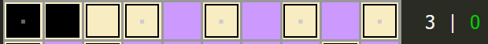
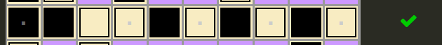
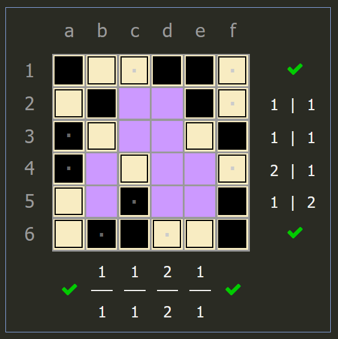
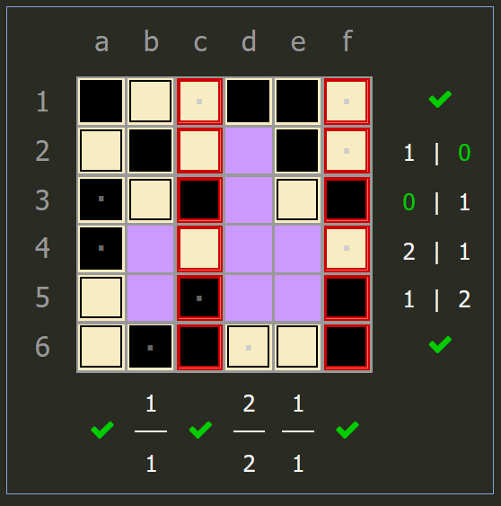
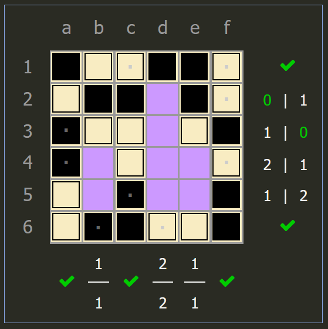
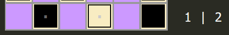
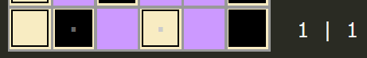
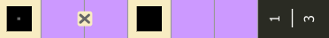

Binairo
=======

Rules
-----

(sourced from `puzzle-binairo.com <https://www.puzzle-binairo.com>`_)

* Binairo is played on a rectangular grid with no standard size.
* Some cells start out filled with black or white circles. The rest of the cells are empty. 
* The goal is to place circles in all cells in such a way that:

  1. Each row and each column must contain an equal number of white and black circles.
  2. More than two consecutive circles of the same color in the same row/column is not allowed.
  3. **Binairo:** Each row and column is unique.
  4. **Binairo+:** Two cells with a "=" sign between them should contain circles of the same type.
  5. **Binairo+:** Two cells with a "x" sign between them should contain circles of the opposite type.

Options
-------

* “Highlight 3 in a row of the same color”
* “Highlight more than allowed of the same color”
* **Binairo:** “Highlight duplicate rows/columns”
* **Binairo+:** "Highlight comparison errors"
* “Prominent errors”
* “Show counters” + “Count remaining”
* The "Squares" style can be helpful for spotting patterns.
* Setting a different default background color also helps.

*(adapted from qqwref, with additional info by beatrixwashere)*

Basic Logic
-----------

The basic logic is pretty easy. If you see two squares of the same color and a blank square on either side,
fill in the blank square with the other color. If you see two squares of the same color separated by a 1-tile blank gap,
fill in the gap with the other color. If you see a counter highlighted with X | 0, fill all the empty squares in that row
with blank; if it’s 0 | X, fill them in with white. The hard part is getting used to seeing them quickly, and more
importantly seeing every single deduction like this, because sometimes puzzles will have no way forward except for one
specific bit of logic.

*intial state of a row with one color left*

*filled state of the row*

Unfortunately, on both easy and hard puzzles, the “Each row and column is unique” rule comes into play, and is often
required, because without that rule there are multiple solutions. I’m not sure how to check for this quickly, but one tip
is that it almost always involves a solved row/column and one with either 2 or 3 tiles unsolved, so that should help narrow
it down when it seems required. This is more common on smaller puzzles, so 14x14 rarely has it and 20x20 almost never does.

*intial state of duplicate step*

*columns c and f are the same*

*columns c and f are unique*

There are a handful of patterns that show up and let you solve a lot of squares at once, like a 2x2 square of the same
color, but you’ll learn those as you go, and the logic is all pretty straightforward so there’s no point listing them out.

Advanced Logic
--------------

On hard puzzles, there is some more complex logic based on the counters. This logic almost always occurs on rows
or columns that have only 1 or 2 remaining of one of the colors. A gap of 2 tiles with a black on one end and a white on
the other end must be filled with one black and one white tile. A gap of 2 tiles with blacks on both ends (or a black on
one end and the puzzle edge on the other end) needs at least 1 white, and the same with colors reversed. A gap of 3 tiles
needs at least 1 white and 1 black. That should either use up all white or all black tiles in the row/column, which means
you can fill in all the other empty squares.

*initial state of counting step*

*a white cell must be on the first column, since a black cell in the same position would force whites in the others, creating three in a row*

If you can’t do that, but can figure out exactly which tiles go in each gap, there is some further logic you can use.
Some gaps can be filled in in only one way given a certain set of available colors. These are all also true with the
colors reversed. See the picture below:

.. image:: ../img/binairo/gaps.png

Binairo+ Introduction
---------------------

As the name suggests, Binairo+ is essentially the same puzzle as normal Binairo, except the "no duplicate rows/columns"
rule is replaced with the "x" and "=" comparisons. This introduces some new logic, and eliminates a lot of the guesswork
that came with the duplicate rule.

Binairo+ Logic
--------------

The most trivial deductions are filling in an incomplete comparison, such as a black circle on an x with a white and blank
cell, or a black circle on an = with a black and blank cell (same applies for swapped colors). Another useful piece of
logic that might not be immediately obvious is that a = next to a filled cell in the same row/column must have the opposite
color on both ends, since it would otherwise form three of the same color in a row. Finding deductions like these quickly
is very important to speedsolving.

It's also relatively common for chains of x's or ='s to appear, which can be especially rewarding. If you find a chain of x's,
simply alternate between colors until you reach the end. = chains are usually in the same row/column, and the same alternating
logic applies except with pairs of two of the same color rather than alternating one by one.

The same counter logic from normal Binairo also applies here, with the comparisons adding some further depth on where
certain colors are forced. Specifically, an x comparison in a row/column takes up one of each color, and a = comparison uses
two of a color. Additionally, odd numbered chains of of x comparisons (ex: three cells in a row with x's between them) contain
one more of a color than the other. These can be subtracted from the total count of cells and colors remaining, and can sometimes
give a needed deduction on hard difficulties. For example, if there are 4 black cells and 1 white cell remaining in a row, and
there is an x comparison in the same row, then there are 3 black cells and 0 white cells apart from the comparison, meaning the
rest can be filled white.

Here's another example (rotated to fit the page better, counter is 1 black left and 3 white left):

Trying to apply the original counter logic doesn't help in this scenario, but since the x comparison requires one black cell
and one white cell, the empty cells outside of it can be colored white, since there will be 2 whites left regardless of how
the black and white in the x is placed.