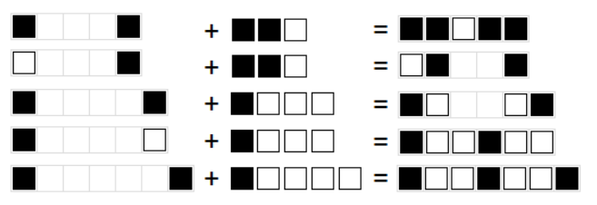

Binairo
=======

Rules
-----

(sourced from `puzzle-binairo.com <https://www.puzzle-binairo.com>`_)

* Binairo is played on a rectangular grid with no standard size.
* Some cells start out filled with black or white circles. The rest of the cells are empty. 
* The goal is to place circles in all cells in such a way that:

  1. Each row and each column must contain an equal number of white and black circles.
  2. More than two circles of the same color can't be adjacent.
  3. Each row and column is unique.

Options
-------

* “Highlight 3 in a row of the same color”
* “Highlight more than allowed of the same color”
* “Highlight duplicate rows/columns”
* “Prominent errors”
* “Show counters” + “Count remaining”

Basic Logic
-----------

*(the remainder of this page is sourced from qqwref's doc)*

The basic logic is pretty easy. If you see two squares of the same color and a blank square on either side,
fill in the blank square with the other color. If you see two squares of the same color separated by a 1-tile blank gap,
fill in the gap with the other color. If you see a counter highlighted with X | 0, fill all the empty squares in that row
with blank; if it’s 0 | X, fill them in with white. The hard part is getting used to seeing them quickly, and more
importantly seeing every single deduction like this, because sometimes puzzles will have no way forward except for one
specific bit of logic.

Unfortunately, on both easy and hard puzzles, the “Each row and column is unique” rule comes into play, and is often
required, because without that rule there are multiple solutions. I’m not sure how to check for this quickly, but one tip
is that it almost always involves a solved row/column and one with either 2 or 3 tiles unsolved, so that should help narrow
it down when it seems required. This is more common on smaller puzzles, so 14x14 rarely has it and 20x20 almost never does.

There are a handful of patterns that show up and let you solve a lot of squares at once, like a 2x2 square of the same
color, but you’ll learn those as you go, and the logic is all pretty straightforward so there’s no point listing them out.

Advanced Logic
--------------

On hard puzzles, there is some more complex logic based on the counters. This logic almost always occurs on rows
or columns that have only 1 or 2 remaining of one of the colors. This is a little hard to explain so I’ll do what I can.
A gap of 2 tiles with a black on one end and a white on the other end must be filled with one black and one white tile.
A gap of 2 tiles with blacks on both ends (or a black on one end and the puzzle edge on the other end) needs at least 1
white, and the same with colors reversed. A gap of 3 tiles needs at least 1 white and 1 black. That should either use up
all white or all black tiles in the row/column, which means you can fill in all the other empty squares.

If you can’t do that, but can figure out exactly which tiles go in each gap, there is some further logic you can use.
Some gaps can be filled in in only one way given a certain set of available colors. These are all also true with the
colors reversed. See the picture below:

