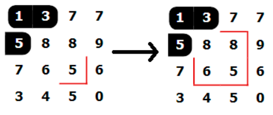
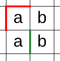
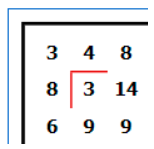

Dominosa
========

Rules
-----

(sourced from `puzzle-dominosa.com <https://www.puzzle-dominosa.com>`_)

* You have to find the location of all dominoes on the grid. A domino is a pair of numbers.
* You can have only one of each pair.

Options
-------

* "Highlight wrong tiles"

Highlighting Techniques
-----------------------

*(most of this page is sourced from qqwref's doc)*

Start by highlighting some specific pair of numbers (or a single number to look for dominoes with two of that tile).
I like to do the single numbers first from 0 to N, and then the pairs from 0-1 to 0-N, then 1-2 to 1-N, and so on.
If there is exactly one place where that pair of numbers can go, place a domino there. If there are two or so places
where that pair of numbers can go, and they are right next to each other, then you may be able to place some walls to
prevent dominoes that would get in the way of all dominoes with this pair of numbers. If there’s nothing like that,
then move on to the next pair. Also, you can use shift+left/right click to highlight numbers quicker.

You can also place dominoes whenever they are forced because a number can only have a domino in one direction.
If you do that, highlight that pair and add a wall to block off any other dominoes with that pair of numbers elsewhere
in the puzzle.

If you try going through the pairs as above, you’ll notice that when you reach the end of the possible pairs you’ll be
missing some logic and have to start over from the beginning, and redo a lot of work by checking pairs you have already
checked. To prevent this, when I add a domino, I like to double-check the potential number pairs that placement prevents -
but only the pairs of numbers that I’ve already looked at. So if I place a 1-8 for instance, I’ll look around the 1 for
another 1 or a number smaller than 8, and around the 8 for another 8 or a number smaller than 1. Sometimes this can lead
to more dominoes being placed in a chain and it can be hard to keep track of things (although Ctrl+Z and Ctrl+Y for undo/redo
help). But the benefit is that if you do this right, by the time you reach the end of the number pairs, the puzzle will
be almost solved.

On very small puzzles there’s no need to be so mechanical, and you can often find things like pairs of the same number
without any highlighting. You can also just guess and see if something works or not, because the puzzle is so small.
Actually, on the very smallest sizes, you can guess the entire solution and sometimes get a good single, because there
aren’t actually very many ways to fill a say 4x5 grid with dominoes.

Error Checking
--------------

As you place more and more dominoes, there will come a point where the puzzle is so filled in that you can do a lot of
work without highlighting anything. Instead, you can just place dominoes where they are forced, and try both dominoes
around a corner to see if one of them highlights as an error (it matches another domino). It’s a judgement call when you
start going like this, but it’s much faster than checking and marking every domino you place.

Parity Logic
------------

There is also some parity-based logic you can use. If an area is only attached to the rest of the puzzle by a
one-tile-wide gap, then you can decide where to place the domino in that gap by whether the area has even or odd size.
Every domino covers two numbers, so an enclosed area must have an even size. By the way, if you ever see a 2x2 region
that is blocked off at two opposite corners, like below, you can block off the other two corners too, because otherwise
the dominoes won’t fit. Some similar ideas in other shapes may also show up from time to time.

Additionally, if an area has two one-tile-wide openings that can both be filled by dominoes with the same pair of numbers,
and blocking both of these dominoes creates an area with an odd size, then that pair must be in one of those two spots,
and any other instances of that pair can be blocked.

Advanced Logic
--------------

Many puzzles have situations where placing one domino would eventually force another domino of that same pair, which isn't
required for most puzzles, but when it is it usually only spans a few dominoes. Bifurication is acceptable in some of these
cases, but with practice it becomes easier to see the solutions to these. There aren't many definitive patterns for
this logic, but this one tends to pop up fairly often:

Red is given, and green can be deducted. In this example, placing a domino over the green line would force the other a/b
pair to be placed.

Uniqueness
----------

Here's one useful uniqueness strategy: whenever there is a corner, or a pseudo-corner (one cell with two domino cells
adjacent to it but not opposite each other), look at the 2x2 area starting from that corner. If either of the pairs of
diagonal numbers are the same, you can place some walls like in the following image:

Note that this can also lead to situations where you know where a number pair goes. For instance, if the 2x2 square here
was rotated clockwise by 90 degrees, you’d know the 3-8 domino was in the corner, so you can add walls between any other
potential 3-8 pair in the grid.

A more useful case of this is when a corner has two possible dominoes that are both the same pair, and the same walls can
be placed to prevent two possible solutions. Additionally, any other instances of the forced pair can be blocked.

Another thing to note is that there are rare cases where this logic can form diagonal chains, and placing blocks leads to
another one of thes scenarios. This doesn't pop up too often, but it's good to look out for.