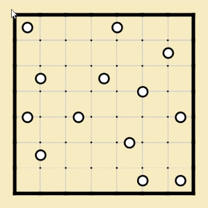
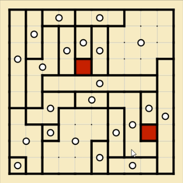
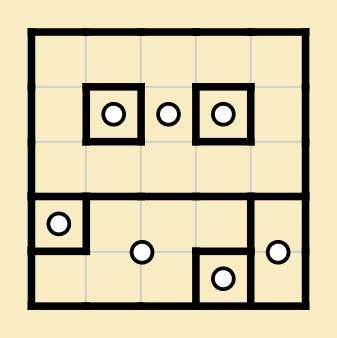
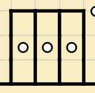
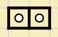
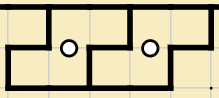

Galaxies
========

Rules
-----

(sourced from `puzzle-galaxies.com <https://www.puzzle-galaxies.com>`_)

* You have to divide the grid into regions (galaxies) in such a way that:
  1. Each region has exactly 1 white circle in it.
  2. The circle is the center of its rotational symmetry. In other words: If you rotate the region around the circle at
     180° you should get the same shape, position and orientation.
  3. A region cannot be a neighbour to itself.

Options
-------

* "Highlight errors"
* "Show grid"
* "Draw continuous line"
* "Enable symmetry helper"

Introduction
------------

.. note::

   This page is adapted from `haramey's Galaxies Speedsolving Guide <https://docs.google.com/document/d/1aLNP7i8tM-BDhwivFIOox9VrCYLFe403hzpnVIgXCUI/edit?usp=sharing>`.

Galaxies is the most intuitive-based puzzle on the site.

You probably know that in other puzzles, sometimes it is faster to solve them by deduction than by using difficult logic.
Galaxies is no different. The only difference is that Galaxies requires deduction at every moment of play, and the easiest
and fastest way is to "ignore" errors until the board is completely filled.

How Does It Work?
-----------------

It is divided into two main parts:

1. Initial Filling (Guessing Phase)

You guess the shape from the circles given. You draw the shape by feeling, but you may encounter logical contradictions and
create errors - closed areas where circles do not exist. Do not solve them right away, but leave them for later. Just focus
on forming all the circles into a galaxy shape.

2. Error Removal (Problem Resolving Phase)

After processing all the circles, there will always be an even number of errors. You will use the galaxies around the errors
to "shuffle" them: move an error to the opposite side of a galaxy, and repeat it until it reaches a dead end or collides with
another error and disappears. You have to repeat the process of pairing up each error - shuffling - to remove all the errors,
and the puzzle is eventually solved.

How to Solve Galaxies Quickly
-----------------------------

1. In the Initial Filling step

Obviously, the closer the guessed shapes are to the correct answer, the fewer errors you will have to deal with. To do this,
you should follow these actions:

a. Solve the easiest circles first.

The common speedsolving principle for almost all puzzles is "leave the difficult parts aside and solve the easy parts first."
You should start with circles whose shapes can be logically determined with certainty, mainly near the corners and borders.
Add more galaxies around the clear clues you have obtained, and if you can no longer get a clear shape, you should immediately
move to another easiest place.

If you repeat this process, even the difficult areas will eventually become easier to form shapes. Except for the border, the
easy areas are generally where the circles are densely packed, and conversely, the difficult areas are where the circles are
not densely packed, and various shapes can be created.

b. Draw the shapes as large and concisely as possible.

If you've dealt with all the "easy areas", you'll eventually end up dealing with the hard areas. What you should do in this
situation is figure out where the largest area is (where there are few circles), decide which circles will occupy that area,
and then draw the galaxy as big and pretty as possible (with as few curves as possible, close to a square).

This is purely the part of intuition. This guess may cause the galaxy to invade the area of ​​another galaxy and make errors,
but it makes much fewer errors than drawing small and complex shapes, also it’s easy to fix later. One thing to be careful
about is that when drawing a large galaxy, there must be enough clues (already drawn galaxies) around it to help draw the shape.
For example, it would be suicidal to draw a large galaxy from a central circle that is far from other clues. You should always
play based on the borders and clues.

c. Solve errors later.

When moving on to the advanced version of the Galaxies guide, you should proceed with the "initial filling" step while making as
few errors as possible. However, since you are reading this guide, you are most likely a beginner, I will introduce the easiest
way to solve the puzzle: ignoring errors.

Guessing the shape is easy and fast, but correcting errors is difficult and slow. Therefore, if you look at the error for a while
and decide that you cannot solve it right away, leave it to the "error removal" step and just continue guessing.

The reason why this method is recommended for beginners is because it is easier to find a path that can eliminate two errors by
pairing them than vaguely trying to eliminate one error. A detailed explanation is provided in the error removal paragraph.

d. Gain a lot of experience.

Ultimately, intuition is the most important thing in order to draw the most perfect shapes from the initial filling step, and a
lot of experience is needed to develop this intuition. When a beginner first starts playing the Galaxies puzzle, it is natural that
it is difficult to come up with the right shape, and they will inevitably make a lot of errors. This is a part that you have to
overcome through experience while solving numerous puzzles. The more puzzles you solve, the less frequently you make errors, and
the more you will be able to think of the right galaxy shape as soon as you see a circle.

(Little tip - if you're having trouble drawing large galaxy shapes, try using the 'symmetry helper'. You can toggle it in the options,
and when you click and drag a circle, it will highlight the cell that is at the symmetry point of your mouse.)

2. In the Error Removal step

This is the most important step that determines the speed of solving the Galaxies puzzle. Unless you are lucky enough, you will have
made at least 2-6 errors and up to 10 or more errors by the time you have filled all the boards. Don't panic because there are too many
errors to solve, and solve them one by one, and you will eventually reach the answer. Below are the most important tips that will help
you eliminate errors.

a. Use color (Shift key).

This is a method of marking cells to be shuffled in advance, as in the photo below. Since there are inevitably multiple paths that can
connect errors in the Galaxies puzzle, it is faster to secure the movement path in advance through marking and start shuffling once the
path is determined, rather than shuffling the errors blindly and going through trial and error.

The advantage of this method is that it ultimately identifies the branch points of the path more quickly and remembers the path instead
of my brain. This is a method that is used permanently from beginner to professional level, so you must learn it.

b. Try to remove as many errors as possible at once.

Errors are sometimes resolved as individual pairs, but sometimes two or more cells are shuffled together as a unit. If the errors are
concentrated in one area when you have fully filled the board, It is likely that several of them will be removed at once in a single
connection process. So, you may shuffle with two or more cells in some cases. If you are shuffling two or more cells and cannot move them
as a unit anymore, then you can separate them.

c. Be creative.

The errors may not always be shuffled into adjacent galaxies. Sometimes you may need to break adjacent galaxies to connect further galaxies
from the error. This is called "stretching".

If you are too stuck by an error, you should consider all the possible galaxies that could reach that cell. If all the galaxies are still not
enough, you have to shuffle it around a bit and try again.

In a very difficult Galaxies puzzle, this work can take over 30 minutes... You may have to connect errors from unexpected circles in very
ridiculous shapes, so it is important to keep an open mind in hard puzzles.

d. Gain a lot of experience.

This is the truth.

Advanced Tips
-------------

Here, I will talk about some tips you need to know to become an ultimate Galaxies pro.

1. As I mentioned earlier, making as few errors as possible in the initial filling stage is eventually the fastest way to solve the puzzle.
   The later you delay solving errors, the longer the potential path for errors to travel, which leads to more time consumption. Therefore,
   if you feel that you are familiar enough with Galaxies puzzles, fill in the shapes while removing errors as much as possible from the beginning.

2. During the guessing phase, you should play while remembering all the potential shapes that the circles can have. This will make it easier
   to deal with errors you encounter later without trial and error.

3. Always keep in mind the donut-shaped galaxy in hard puzzles. This is the type that beginners are most confused about when they first encounter
   it. It is not a rare shape in small puzzles, so if there are an odd number of circles placed symmetrically, try wrapping it in a donut shape.

4. Beware of patterns that violate the uniqueness logic. Every puzzle on the site has only one solution. If there are multiple galaxies in a
   region that can exist in different shapes, that means the shapes in that region need to be modified. The picture below is an example.

5. Once you are comfortable enough with coloring the cells, you can sometimes just follow the path with your eyes instead of coloring the cells.
   However, this method can be difficult to remember the paths in large puzzles, so you can trace the path with your eyes first and then start
   coloring when you reach an intersection.

6. The pictures below are patterns that the generator avoids.

I swear I've never seen two consecutive one-cell galaxies. Also, two consecutive S galaxies appear very rarely.