Hashi (Bridges)
===============

Rules
-----

(sourced from `puzzle-bridges.com <https://www.puzzle-bridges.com>`_)

* Hashi is played on a rectangular grid with no standard size.
* Some cells start out with numbers from 1 to 8 inclusive; these are the islands. The rest of the cells are empty. 
* The goal is to connect all of the islands into a single connected group by drawing a series of bridges between the islands.
* The bridges must follow certain criteria:

  1. They must begin and end at distinct islands, travelling a straight line in between.
  2. They must not cross any other bridges or islands.
  3. They may only run orthogonally.
  4. At most two bridges connect a pair of islands.
  5. The number of bridges connected to each island must match the number on that island.

Options
-------

* “Click/tap between islands to draw bridges”
* “Auto mark completed islands”
* “Gray out bridges to completed islands”
* "Left click - 1 bridge, Right click - 2 bridges" - this is up to you, but many find it advantageous
* "Completed numbers style" - whatever you find most visually obvious

Basic Logic
-----------

*(the remainder of this page is from qqwref's doc, adapted by ailurus)*

The bulk of the logic for hashi involves comparing the number in an island with the number of possible bridges that can
be connected to that island. Start by looking for islands that require near as many bridges as are available to them.
For example, any 8 will necessarily have two bridges in each direction. A 7 will need at least one bridge in each
direction. 

|ico1| |ico2|
In the case of the 7, all but one direction will have two bridges, but since we cannot know which in this scenario, we will
place single bridges and come back to it once we have more information about the surrounding islands.

Not all islands will have four directions available, which further restricts the number of bridges you can 
place on them. A 4 in the corner of the puzzle will need two bridges in each direction. A 6 with one side blocked (by a
bridge, or with no other islands in that direction) will need two bridges in each remaining direction. 

|ico3| |ico4|

The edge of the puzzle is not the only factor that can restrict available directions. Islands that already have the correct
number of bridges will not be able to connect to any other islands. Bridges cannot cross, so they can also create barriers
between islands.

|ico5| |ico6|
*Here, the 3 cannot take any more bridges, so the only option left for the 1 is a bridge to the left.*

|ico7| |ico8|
*Here, the 2 is blocked from connecting to the 3 above it by a bridge, leaving only one direction, meaning both required
bridges will go left.*

This logic can be applied to partially completed islands as well. Consider a 6 which you know has exactly one bridge on
it's right side. What you are left with is equivalent to having a 5 with three directions available to it, meaning there
will be at least one bridge in each of those directions. Similarly, islands with exactly one bridge remaining to be placed
can constrain nearby islands. A 4 with three bridges already connected in other directions can tell us that an adjacent 6
has at least one bridge in each direction not connected to the 4. If the single bridge remaining from the 4 were to connect
to the 6, you would have the situation described above. Otherwise, the 6 would effectively only have 3 directions available,
meaning two bridges in each direction.

Another type of logic to watch out for is connectivity. All islands in a puzzle need to be connected in a single group, so 
we can disregard any placements that would isolate any group of islands. 1 islands are often involved in this kind of logic,
since they can create "dead ends" that will not connect any further to the rest of the puzzle. What this means in practice is
if you have a disconnected group of islands that can take only one more bridge, that bridge cannot go to a 1. Common instances
of this pattern include adjacent 1s, which will never connect to each other, and a 1-2-1 pattern, in which the 2 must connect
to at most one of the 1s.

|ico9| |ico10|
*This is an example of the 1-2-1 pattern. If the 2 connects to both 1s, below and to the right, that group will be isolated.
Thus, we know that the 2 must have at least one bridge going up (the left side is already blocked). In fact, we will have
exactly one bridge going up, otherwise we will form an isolated group with the 2 above.*

Advanced Logic
--------------

Connectivity can also get more involved. Hard puzzles often have small loops where there are two ways to place the bridges,
but only one connects the puzzle together. If you run out of logic on individual islands, find the part that needs to be
connected, add a bridge there, and then work around the loop. If you find it hard to see which islands are already connected,
hold shift and mouse over the puzzle to highlight groups of islands.

|ico12| |ico13| |ico14|
*If the 3 in the bottom right here connects another bridge to the 2 below it, that group of islands will be unable to connect
to the rest of the puzzle, as shown in the second image. Thus, the 3 must instead have it's last bridge going left.*

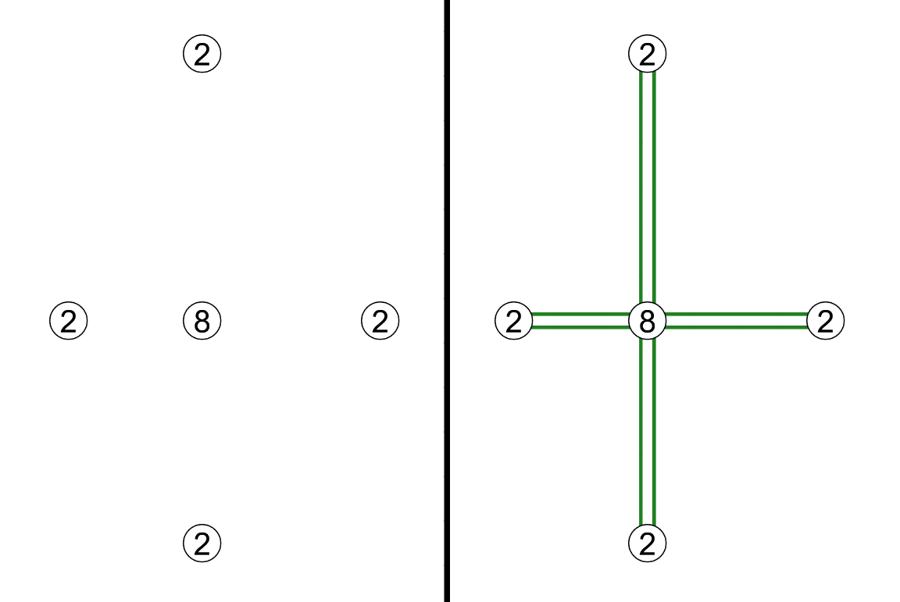
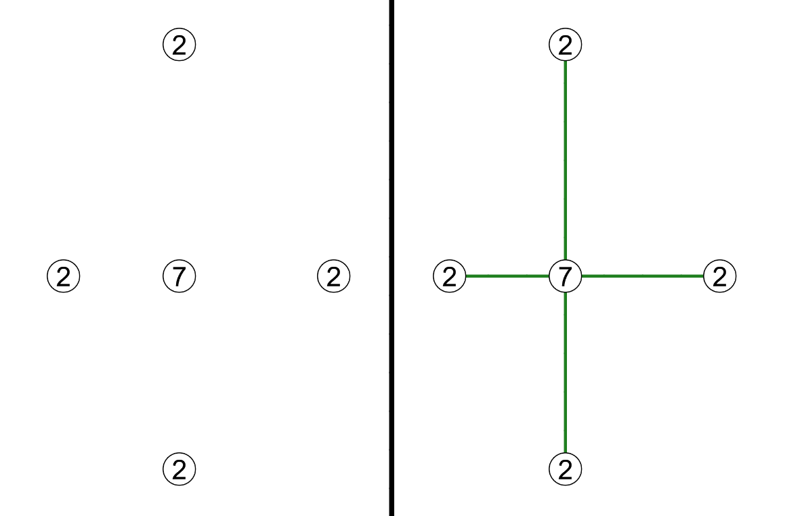

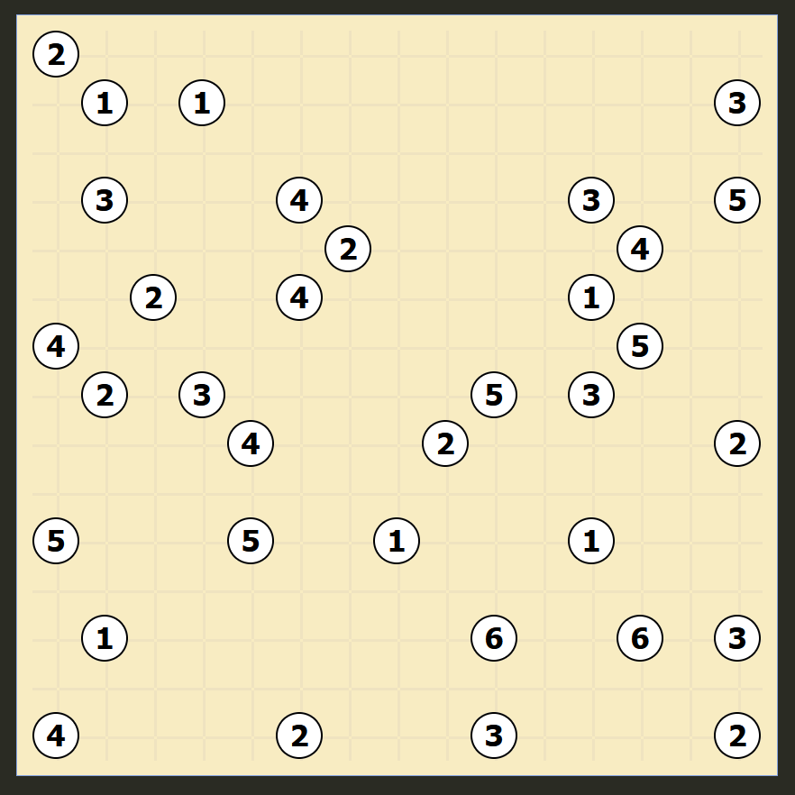
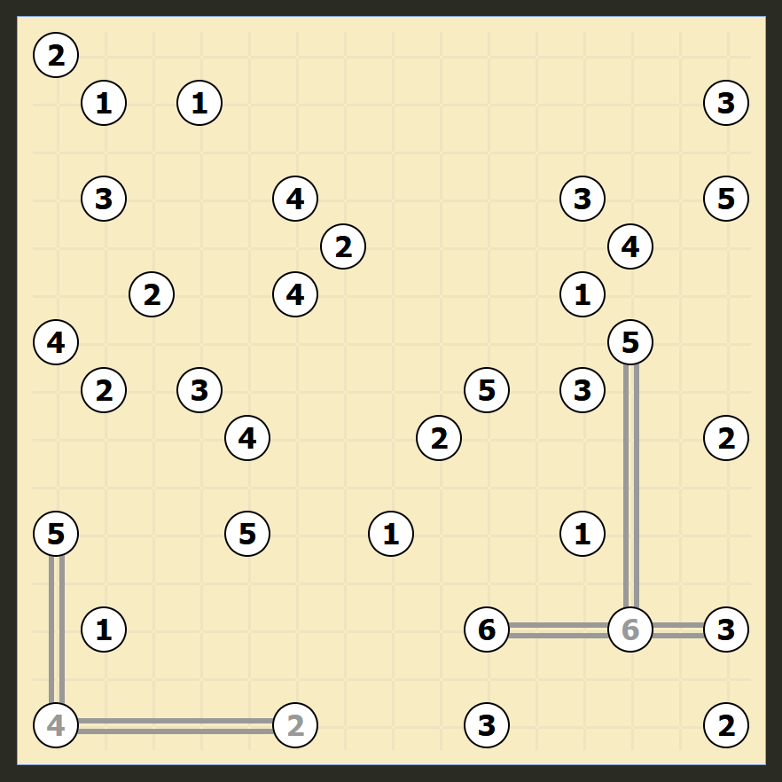

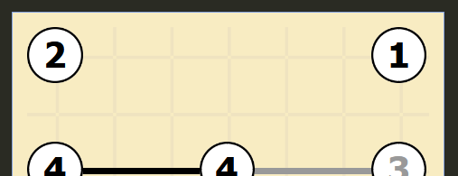
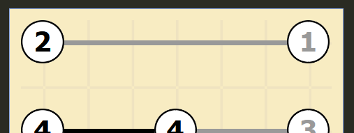

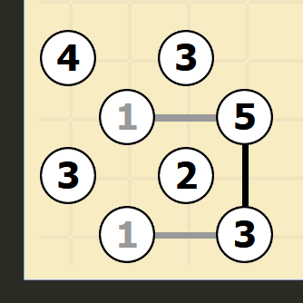
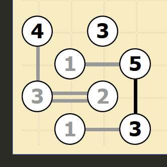

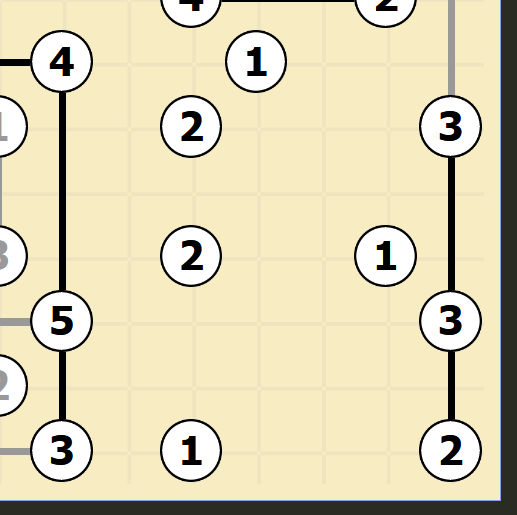
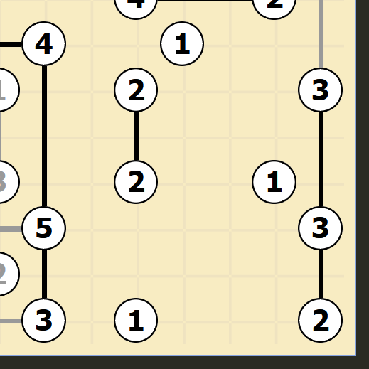

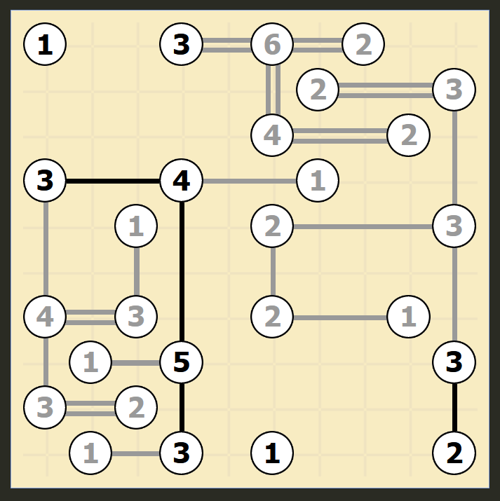
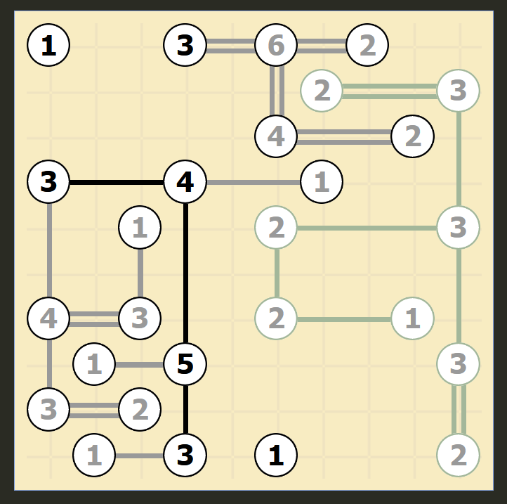
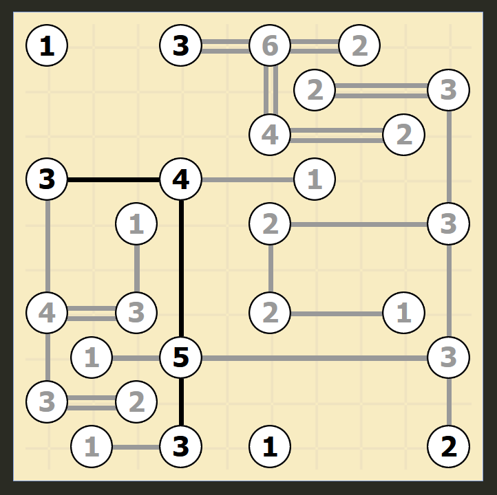