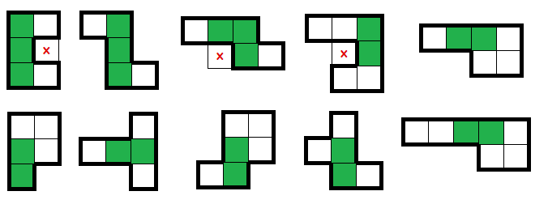
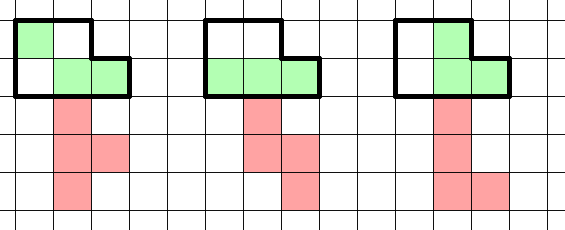
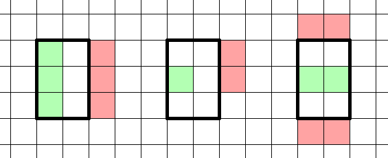
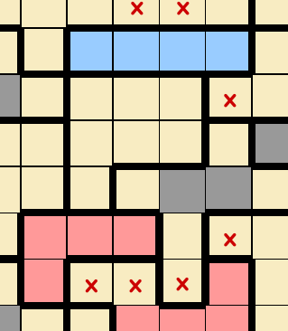
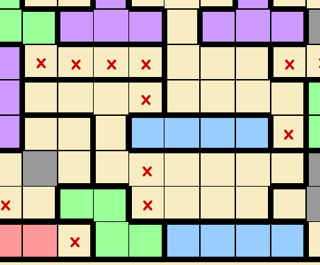

LITS
====
Rules
-----

(sourced from `puzzle-lits.com <https://www.puzzle-lits.com>`_)

* You have to place one tetromino* in each region in such a way that:
   1. 2 tetrominoes of matching types cannot touch each other horizontally or vertically. Rotations and reflections count as matching.
   2. The shaded cells should form a single connected area.
   3. 2x2 shaded regions are not allowed.

\* *Tetromino is a shape made of 4 connected cells. There are 5 types of tetrominoes, which are usually named L, I, T, S, and O,based on their shape. The O tetromino is not used in this puzzle because it is a 2x2 shape, which is not allowed.*

Options
-------

* "Highlight errors"
* "Thicker block borders"
* "Color tetrominoes"
* "Auto place X on corners"
* "Auto place X in completed regions"

Basic Logic
------------

*(this section is sourced from qqwref's doc, adapted by ailurus)*

The easiest places to start solving a LITS puzzle are regions with less empty space, and thus fewer options for how their tetrominoes can be placed. 4-cell shapes can be filled immediately. Within the small regions, there will be cells that must be shaded, since any tetromino configuration will use that cell. Another way to look at this is that placing an X in those cells will make it impossible to fit a tetromino in that region. The “no 2x2s” constraint is relevant here. If placing an X in a cell would force a 2x2 then you know that cell is shaded, and vice versa. Placing squares will often lead to X’s which restrict nearby shapes. When trying to see what tetrominoes can fit in a shape, you can either guess that a square is in a certain position (usually in a blank space that connects to only one other blank space, or next to some other squares so you get free X’s from the 2x2 blocks) and see if there is a valid placement or not, or you can just try all possible tetrominoes if the number is small enough.

The rule about all pieces being connected is important, but a lot of the time the tetrominoes will end up connected anyway without you needing to deliberately apply this rule. If you want to check for the rule being broken, you can hold shift and hover over a piece to see every other piece it’s connected to. You can also quickly add and remove an X in a certain place to see if it blocks off a section of the puzzle, which will highlight as an error.

Having to avoid touching tetrominoes of the same shape is a big part of solving, and it seems like the L shape is generally the most common and the most important to avoid. Some shapes have a known tetromino before you even place any squares: a straight line can only have I, an X pentomino can only have T, a worm (a one-tile-wide path without any branches) that turns every square can only have S, and a worm that turns every two squares such as a U/V/Z pentomino can only have L.  Below are some common shapes and what you can learn from each one in isolation:

Patterns
--------

In addition to the above patterns, there are a number of more involved deductions that are useful to become familiar with. With the above advice, you should be able to verify these patterns yourself. 

**P pentomino**

The P pentomino is very common, and extra special because once you place the first squares, there are three possible tetromino positions and each one that you rule out gives you only more square. Based on adjacent tetrominoes, they can be filled beyond the two cells which can be shaded in every P pentomino. These patterns can be generalized, what’s relevant is that if you can’t place the red tetromino, then you know you can shade the green cells. 

**2x3 Patterns**

With the red cells given, we can deduce the green. In general, when faced with a 2x3 or something close to it, try thinking about what would happen if you place an X in the middle of the long side. This is particularly helpful in cases where the opposite side is covered or partially covered. Often this forces an L tetromino, which must run along the edges and thus would cause a shaded 2x2. In these cases, that middle cell must be shaded. 

Here’s an example of extending the pattern. The middle cell of that empty region cannot be an X without causing a 2x2, so must be shaded. 

We can often extend this to any 2-by-X area, for example in this region, we cannot fit any tetrominoes between the two I pieces without creating a 2x2 shaded region. As a result, we know that the shaded cells will instead be to the left of the top I piece. 
