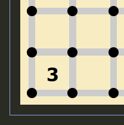
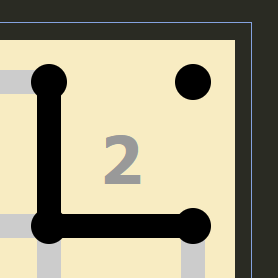
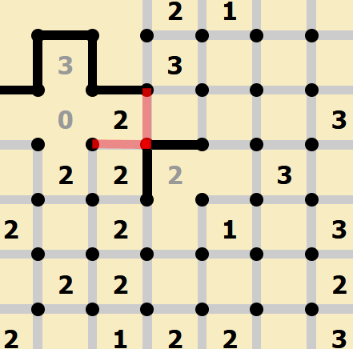

Loop (Slither Link)
===================

Rules
-----

(sourced from `puzzle-loop.com <https://www.puzzle-loop.com>`_)

* You have to draw lines between the dots to form a single loop without crossings or branches.
* The numbers in each cell indicate how many lines surround it.

Options
-------

* “Auto cross the sides of completed numbers”
* “Gray out completed numbers”
* “Highlight wrong numbers”
* "Highlight wrong moves"
* "Draw continuous line"
* "Ghost lines mode" - *Visual change, blank spaces instead of Xs. This is up to preference.*

*(parts of this document are sourced from qqwref's doc)*

Terminology
------------

In the interest of effective communication, let's take a moment to establish the terminology I'll be using in this guide.

|ico13|

In the above image, the highlighted dot is "shared" between the x and the y. The line "belongs to" y, and is "pointing at" x.

|ico14|

Here, the line is "exiting" from the y via the highlighted dot, and "entering" the x via that dot. To explain this, we need to
look at our first piece of logic.

Basic Loop Logic
-----------------

Because any line segment in the puzzle must be part of the same closed loop, we know that dots must have either zero or two
lines. Three or four lines would result in a cross, and one line would cause a break in the loop. 

Thus, any time you draw a line connected to a dot, you will at some point need to add another line to that same dot. Thinking
about this in terms of entering and exiting a dot will help us identify some patterns.

Any line that enters a point must be able to exit it, so looking for dead-ends can show us where to place Xs. 

|ico15| |ico16|

I will be using penpa+ to construct most of the examples in this guide, but the ghost lines mode on puzzle team is also useful
to visualize some properties, so I've included a screenshot of that here. The dead-end in both images is the same, because we
are unable to place lines around the 0s, the dots that they share have only one eligible direction to place a line. If we were
to place a line in this spot, it would enter but have no way to exit, so we know that the remaining direction is an X as well.

|ico17| |ico18|

In addition, we can think of dots around the border of the puzzle as having Xs in the directions we can't see. As a result, we
can place a few more Xs using the same logic. Ghost lines mode makes this quite clear, since we can see that a line in those
spots would not have anywhere to go. Since the edges of the puzzle are more constrained, they're a good place to start a solve.

Corners
-------

Using the same idea as above, we can make some quick deductions about the corners of the puzzle. We will also start to look at
the properties of each number and how they differ.

|ico19| |ico20| |ico21| |ico22|

A 2 or 3 in the corner of the puzzle give us some lines that we can place immediately. This logic follows from the loop properties
we discussed earlier, in combination with the properties of 2s and 3s. Each clue has a number of possible configurations. 1s and 3s
have four each, while 2s have six. 0s only have one. 

Let's take a moment to try each possible 3 configuration in a corner, and see what we can learn. 

|ico25| |ico26| |ico27| |ico28| |ico29|

It is helpful to think of both the number of lines around a clue as well as the number of blank sides. Consider that a 
3 will only have one open edge. In the first and second images, where the blank spaces are touching the corner dot, we
end up with a line that has nowhere to go (a dot with only one line). This means that our blank side cannot be either
side that touches that dot. As a result, we know that those sides will be lines. In fact, any time you see a 3 with one
corner blocked like this, you can place these lines. 

|ico30| |ico31| |ico32|

As you might have guessed, a line entering a "corner" dot like this will have to exit on the same cell, forming an "L"
shape. Let's try to apply this now to a 2 in a corner. Out of the 6 possible configurations for a 2, we can immediately
rule out the parallel line options, since they would leave us with a line that has nowhere to go. Out of the remaining
configurations, there are two valid options for a given corner cell, depending on it's location.

|ico33| |ico34| |ico35|

Although no lines from these cases overlap, we can still place some which we know must result from either layout. This
sort of "flip-flop" that we get from 2s has a wide range of uses, which we will get into in the next section.

2s
----

In any of the possible 2 configurations, you will end up with lines exiting on two opposite corners. What this means to
us is that when we have a line that definitely enters a 2, we know that the 2 will have a line exiting on the opposite
corner. If it didn't, you would end up with either too many or too few lines on the cell. In the image below, we can see
that the green dot has exactly one line entering it from the partially completed 2. As a result, there will be exactly
one line exiting from the blue dot.

|ico36| |ico37|

|ico38| |ico39|

If we tried the configurations that would not result in a line exiting the blue dot, we can see that either option will
break the top 2. It would either be forced to have too many lines (since otherwise we have a dead end), or have no space
for it's second line. We will revisit this later, but this knowledge lets us place two Xs on the diagonally adjacent 1.

|ico40|

What you may have noticed in the above image is that we could make the same deduction about the 1 if it had been directly
next to the first 2. As it turns out, diagonally adjacent 2s essentially propagate their corners through to the end of 
the chain. We could have any number of 2s between the initial 2 and the 1, and we would still be able to place those Xs!

A common instance of this type of propagation is an L-shaped corner pointing at a chain of 2s.

|ico41| |ico42|

.. note::

   This section is under construction. See the
   `Contributing page <https://puzzle-team-advice.readthedocs.io/en/latest/contributing.html>`_ to learn how to contribute.

3s
---

|ico23| |ico24|

If this open edge is not touching the corner with the existing edge, then you will end
up with three lines on that dot. This means that one of the edges touching that corner must be open, and since we only
have one open edge, the edges which don't touch that dot must have lines. Since we know that the other line on this dot
will belong to the 3, the last available direction will be an X.

|ico4| |ico5|

We can also think about this in terms of lines entering cells. A 3 has two corners with two lines each and two corners
with one line each, so if a line is entering a 3 square, it must enter one of the corners with one line and therefore
the opposite corner of the 3 has two lines.

We can flip this idea around as well. Consider a 3 for which you have already deduced two lines forming a corner. What 
can we say about the dot opposite this corner? We know that it will have one line belonging to the 3, which means that
it will have one more line, which cannot belong to the 3. This brings us to a common pattern, diagonally adjacent 3s.

|ico6| |ico7|

It is helpful to think of the 3s here in the same way that we thought of the line in the previous example. Each 3 acts
as an incoming line to the other 3, meaning the opposite corners must be lines. We can use this kind of thinking with
any configuration that results in a line "pointing at" or "entering" a 3. For example, let's extend the 1 we looked at
earlier.

|ico8| |ico9|

Because we know that the dot in between the 3 and 1 will have a single line entering from the 1, it will only have one
line belonging to the 3, so it's gap will belong to that dot. 

Another common 3 pattern, which is often helpful when beginning a solve, is orthogonally adjacent 3s. 

|ico12| |ico11| |ico10|

There are only two valid configurations, so we can mark the lines that appear in both, and add the final lines later.

1s
---
A 1 will be surrounded by one line and three Xs. If the line connects to a dot shared with a 0, you will not be able to add
the second line (remember, a dot must have either zero or two lines) to that dot without overloading the 1. 

|ico1| |ico2| |ico3|

To rephrase, a 1 has one line, but this also means that two of the corners will have two X’s each, so if for instance
a 1 is diagonally next to a 0, the two edges next to the 0 must be X’s because they can’t both be lines. 

.. |ico1| image:: ../img/loop/loop2.png
   :class: no-scaled-link
   :width: 30%
.. |ico2| image:: ../img/loop/loop3.png
   :class: no-scaled-link
   :width: 30%
.. |ico3| image:: ../img/loop/loop4.png
   :class: no-scaled-link
   :width: 30%

.. |ico5| image:: ../img/loop/loop7.png
   :class: no-scaled-link
   :width: 25%
.. |ico4| image:: ../img/loop/loop6.png
   :class: no-scaled-link
   :width: 70%

.. |ico6| image:: ../img/loop/loop13.png
   :class: no-scaled-link
   :width: 45%
.. |ico7| image:: ../img/loop/loop14.png
   :class: no-scaled-link
   :width: 45%

.. |ico8| image:: ../img/loop/loop15.png
   :class: no-scaled-link
   :width: 45%
.. |ico9| image:: ../img/loop/loop16.png
   :class: no-scaled-link
   :width: 45%

.. |ico10| image:: ../img/loop/loop18.png
   :class: no-scaled-link
   :width: 30%
.. |ico11| image:: ../img/loop/loop19.png
   :class: no-scaled-link
   :width: 30%
.. |ico12| image:: ../img/loop/loop20.png
   :class: no-scaled-link
   :width: 30%

.. |ico13| image:: ../img/loop/loop21.png
   :class: no-scaled-link

.. |ico17| image:: ../img/loop/loop25.png
   :class: no-scaled-link
   :width: 45%
.. |ico18| image:: ../img/loop/loop26.png
   :class: no-scaled-link
   :width: 45%

.. |ico19| image:: ../img/loop/loop27.png
   :class: no-scaled-link
   :width: 22%
.. |ico20| image:: ../img/loop/loop28.png
   :class: no-scaled-link
   :width: 22%
.. |ico21| image:: ../img/loop/loop29.png
   :class: no-scaled-link
   :width: 22%
.. |ico22| image:: ../img/loop/loop30.png
   :class: no-scaled-link
   :width: 22%

.. |ico23| image:: ../img/loop/loop31.png
   :class: no-scaled-link
   :width: 45%
.. |ico24| image:: ../img/loop/loop32.png
   :class: no-scaled-link
   :width: 45%

.. |ico26| image:: ../img/loop/loop34.png
   :class: no-scaled-link
   :width: 18%
.. |ico27| image:: ../img/loop/loop35.png
   :class: no-scaled-link
   :width: 18%
.. |ico28| image:: ../img/loop/loop36.png
   :class: no-scaled-link
   :width: 18%

.. |ico30| image:: ../img/loop/loop42.png
   :class: no-scaled-link
   :width: 30%

.. |ico32| image:: ../img/loop/loop43.png
   :class: no-scaled-link
   :width: 30%

.. |ico34| image:: ../img/loop/loop49.png
   :class: no-scaled-link
   :width: 30%
.. |ico35| image:: ../img/loop/loop50.png
   :class: no-scaled-link
   :width: 30%

.. |ico36| image:: ../img/loop/loop51.png
   :class: no-scaled-link
   :width: 45%
.. |ico37| image:: ../img/loop/loop52.png
   :class: no-scaled-link
   :width: 45%

.. |ico38| image:: ../img/loop/loop53.png
   :class: no-scaled-link
   :width: 45%

.. |ico41| image:: ../img/loop/loop56.png
   :class: no-scaled-link
   :width: 45%
.. |ico42| image:: ../img/loop/loop57.png
   :class: no-scaled-link
   :width: 45%