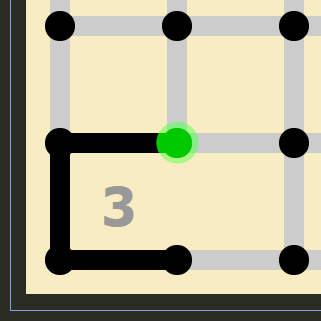
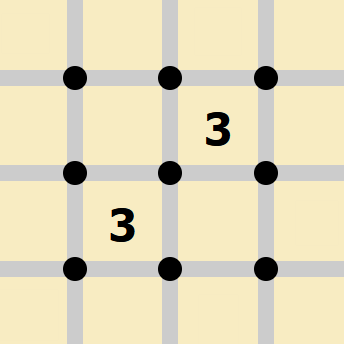
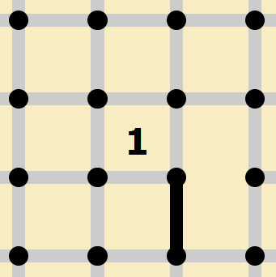
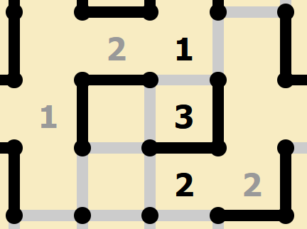
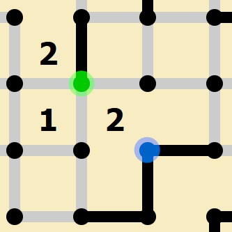
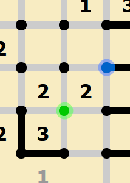

Loop (Slither Link)
===================

Rules
-----

(sourced from `puzzle-loop.com <https://www.puzzle-loop.com>`_)

* You have to draw lines between the dots to form a single loop without crossings or branches.
* The numbers in each cell indicate how many lines surround it.

Options
-------

* “Auto cross the sides of completed numbers”
* “Gray out completed numbers”
* “Highlight wrong numbers”
* "Highlight wrong moves"
* "Draw continuous line"
* "Ghost lines mode" - *Visual change, blank spaces instead of Xs. This is up to preference.*

*(parts of this document are sourced from qqwref's doc)*

Terminology
------------

In the interest of effective communication, let's take a moment to establish the terminology I'll be using in this guide.

|ico13|

In the above image, the highlighted dot is "shared" between the x and the y. The line "belongs to" y, and is "pointing at" x.

|ico14|

Here, the line is "exiting" from the y via the highlighted dot, and "entering" the x via that dot. To explain this, we need to
look at our first piece of logic.

Basic Loop Logic
-----------------

Because any line segment in the puzzle must be part of the same closed loop, we know that dots must have either zero or two
lines. Three or four lines would result in a cross, and one line would cause a break in the loop. 

.. image:: ../img/loop/loop1.png

Thus, any time you draw a line connected to a dot, you will at some point need to add another line to that same dot. Thinking
about this in terms of entering and exiting a dot will help us identify some patterns.

Any line that enters a point must be able to exit it, so looking for dead-ends can show us where to place Xs. 

|ico15| |ico16|

Most of the examples in this guide come are presented using ghost lines mode, but I've included some penpa+ examples as well.
The dead-end in both images is the same, because we are unable to place lines around the 0s, the dots that they share have only
one eligible direction to place a line. If we were to place a line in this spot, it would enter but have no way to exit, so we 
know that the remaining direction is an X as well.

|ico17| |ico18|

In addition, we can think of dots around the border of the puzzle as having Xs in the directions we can't see. As a result, we
can place a few more Xs using the same logic. Ghost lines mode makes this quite clear, since we can see that a line in those
spots would not have anywhere to go. Since the edges of the puzzle are more constrained, they're a good place to start a solve.

Corners
-------

Using the same idea as above, we can make some quick deductions about the corners of the puzzle. We will also start to look at
the properties of each number and how they differ.

|ico19| |ico20| |ico21| |ico22|

A 2 or 3 in the corner of the puzzle give us some lines that we can place immediately. This logic follows from the loop properties
we discussed earlier, in combination with the properties of 2s and 3s. Each clue has a number of possible configurations. 1s and 3s
have four each, while 2s have six. 0s only have one. 

.. image:: ../img/loop/loop9.png

Let's take a moment to try each possible 3 configuration in a corner, and see what we can learn. 

|ico25| |ico26| |ico27| |ico28| |ico29|

It is helpful to think of both the number of lines around a clue as well as the number of blank sides. Consider that a 
3 will only have one open edge. In the first and second images, where the blank spaces are touching the corner dot, we
end up with a line that has nowhere to go (a dot with only one line). This means that our blank side cannot be either
side that touches that dot. As a result, we know that those sides will be lines. In fact, any time you see a 3 with one
corner blocked like this, you can place these lines. 

|ico30| |ico31| |ico32|

As you might have guessed, a line entering a "corner" dot like this will have to exit on the same cell, forming an "L"
shape. Let's try to apply this now to a 2 in a corner. Out of the 6 possible configurations for a 2, we can immediately
rule out the parallel line options, since they would leave us with a line that has nowhere to go. Out of the remaining
configurations, there are two valid options for a given corner cell, depending on it's location.

|ico33| |ico34| |ico35|

Although no lines from these cases overlap, we can still place some which we know must result from either layout. This
sort of "flip-flop" that we get from 2s has a wide range of uses, which we will revisit later.

With these basic patterns under your belt, you should be able to complete this `example puzzle <https://swaroopg92.github.io/penpa-edit/#m=solve&p=vZRNb6M8EMfvfArksw8EQptyy9NN9tKn+9ZVVVkocojboJiQNbCNiNLP3pkhWWqg0u5hVw6j4Yc9Hnvmn+JHJY3iIYxgwj0+guH7E3rGHv7O4y4ttYpctZfZTitX5/nOHfFpVa5zE7ky1ZWpCs4TLYsiTdxCp+VaGZ1uN66ptCr4p/mcP0pdKEecYsaOYD7jbASPz+KXevYi8CWInUP9NTrUi0jER15/b91J636LDmBvowPzRywSzGOQOyyPIZjfBQECCP0LjBEELQg8BJDNGYQ9cNFZEl52goaTzrbhlQUg3REl/UB2TtYnewdn4nVA9gNZj2xI9obmzMjek70mOyZ7QXMu8VYcR/hNEXGEv+dBGeDCWZHrRVGZR5koFlGhOLFtlS2VsRAWHyprz0uftrlRg58QqtUTwNJU1vRlblYYvOXPUmtrcdOiFkpSk2gblSa13qUx+bNFMlmuLbCUJbR0sU53diS1Le0ESmkfX25kZ7esPfHRYXtGjwjgdsfYy1dRPeX1x6afzu3O6y/QzP9H9Qx7WTDoEio1tZQP7qx17+k7etenlvPAvz354D6A29zK4qYhnyNR33GG+/xHq9FlWf4TEqVl9J7k2RKOItiby2i+FNUq31TnDsfenb6fbtCmi26TLnp/K13spv1QplfxsamA90f/If9AmvuTxnIzKDPAA0oDOqioE29EZfOegHDDvoaADsgIaFdJgPpiAtjTE7B3JIVRu6rCrLrCwq162sKt3spLxM4r&a=NZDNDcYwCEN3yTmHGL6fZpaq+69ROxgpEi8uvIje9zN1BtaaWJgY07zNzMD74Q85zV8y74fZi6tYvbBHFWFm7VnNRTPn4m+mJ/zWYTuVhZ2qYadqdk5fdk5f/sx0pP3q7R59d765ilYr3DWooh1H/SCd5wU=>`_.

3s
---

3s can often give us lines at a glance, especially when they appear together. First, let's take the corner 3 we looked at
previously. We know we where two of the lines will be, but this also gives us information about the dot in the open corner
of the cell.

|ico43| |ico44| |ico45|

Wherever we place the last line to complete the 3, we will be left with a line exiting via the green dot. Put another way,
there will need to be a line entering the 3 via that dot.

As it turns out, we could make this deduction in reverse as well. When we know a 3 has a line entering from one corner, we
can place lines forming the L-shape on the opposite corner. A 3 cell will have only one open edge. If this open edge is not
touching the corner with the incoming line, then you will end up with three lines on that dot, which is not allowed. This 
means that one of the edges touching that corner must be open, and since we only have one open edge, the edges which don't
touch that dot must have lines. Additionally, since we know that the other line on this dot will belong to the 3, the last 
available direction will be an X.

|ico46| |ico47| |ico48| |ico49|

We can also think about this in terms of lines entering cells. A 3 has two corners with two lines each and two corners with 
one line each (touching the open edge). If a line is entering a 3 square, it must enter one of the corners with one line,
therefore the opposite corner of the 3 has two lines. 

This brings us to a common pattern, diagonally adjacent 3s. We know that the shared dot must have two lines, since there are
no possible 3 configurations that involve dots with no lines. If we let both lines on this shared dot belong to only one of
the 3s, the other would be left with zero on that dot, eliminating all possible 3 configurations. Thus, we know that a line 
will enter one 3 and exit the other on this dot. It is helpful to think of the 3s here in the same way that we thought of the
line in the previous example. Each 3 acts as an incoming line to the other 3, meaning the opposite corners must be lines.

|ico50| |ico51| |ico52|

In general, we must avoid having a corner pointing into a 3, since we would then be able to place at most two lines out of three.

Another common 3 pattern, which is often helpful when beginning a solve, is orthogonally adjacent 3s. If we leave the edge shared
by both 3s empty, we will end up with an isolated loop, so we know that line must be marked. If we leave the edges on a given end
(parallel to that middle line) of the group empty, the other 3 will not have enough spaces for all it's edges. Thus, we can mark 
these lines as well. 

|ico53| |ico55| |ico54|

This pattern can extend over any number of orthogonally adjacent 3s. We can mark the lines we know and come back later once we have
more information. Once any of the uncertain edges are determined, all of the 3s in the group can be solved, since there are only two
valid configurations.

|ico56| |ico57| |ico58| |ico59|

2s
----

Let's start again by looking at a single line entering our clue cell. In general, any of the possible 2 configurations end up with lines
exiting on two opposite corners. What this means to us is that when we have a line that definitely enters a 2, we know that the 2 will 
have a line exiting on the opposite corner. If it didn't, you would end up with either too many or too few lines on the cell. In the image
below, we can see that the green dot has exactly one line entering it from the partially completed 2. As a result, there will be exactly
one line exiting from the blue dot.

|ico36| |ico37|

|ico38| |ico39|

If we tried the configurations that would not result in a line exiting the blue dot, we can see that either option will
break the top 2. It would either be forced to have too many lines (since otherwise we have a dead end), or have no space
for it's second line. We will revisit this later, but this knowledge lets us place two Xs on the diagonally adjacent 1.

|ico40|

What you may have noticed in the above image is that we could make the same deduction about the 1 if it had been directly
next to the first 2. As it turns out, diagonally adjacent 2s essentially propagate their corners through to the end of 
the chain. We could have any number of 2s between the initial 2 and the 1, and we would still be able to place those Xs!

A common instance of this type of propagation is an L-shaped corner pointing at a chain of 2s.

|ico41| |ico42|

Since a corner pointing towards a 2 will force the opposite corner to have both lines, we know that we can't have any lines
entering on that opposite corner. Together with the reverse case, where a line entering a 2 means the opposite corner will 
have a line exiting (and thus can't be a corner pointing at the 2), we can make a new deduction. If two opposite corners of a
2 both have lines which may possibly enter the 2, those lines will definitely enter the 2.

|ico81| |ico82| |ico83| |ico84|

This works even when we are unsure of how the line will be entering. For example, if we have a 2 diagonally adjacent to a 3, 
with a line entering the dot on it's opposite corner, we know that the line exiting that dot will belong to the 2.

|ico90| |ico91|

A good place to look for this pattern is near diagonally adjacent 3s.

|ico88| |ico89|

1s
---

Starting again with a single line entering the cell, 1s are pretty straightforward. Since only one edge will be filled, we 
know that this edge is sharing a dot with our incoming line. That means we can place Xs on the other two edges. 

|ico60| |ico61|

When a 1 has a dot with only two possible directions, both belonging to the 1, we know that our line will not belong to that
dot. If it did, we would need to both enter and exit that dot on the 1, meaning we would end up with too many lines. Thus, we
know that dot is empty, and our line belongs to the dot on the opposite corner.

|ico62| |ico63| |ico64|

Our line will need to exit from this corner, so if we only have one way for that to happen, we can fill that line. Otherwise, we
can just keep in mind that we will have a line pointing out from that 1, similar to a 2 with a line entering the other corner.

|ico65| |ico66|

Advanced
---------

The above sections should hopefully be enough for you to eventually arrive at the next patterns on your own, and I encourage you
to play a bit and see what you can discover. That being said, here are some more involved patterns that result from 
some of what we talked about in the previous sections. I'll be using examples found in the wild this time, so don't worry too 
much about the extra numbers or markings, just focus on the conditions of the pattern in question.

Consider a 2 with one decided blank side. The key thing to notice about this configuration is that we cannot have a corner
pointing inwards towards either the green or blue dot. If we do, we eliminate two other edges, leaving us with only 1 spot to 
place a line. In the below example, that means that the line entering the green dot must belong to the 2. Since we can only have
the one edge coming from green, our remaining edge for the 2 is the bottom, connected to the blue dot.

|ico67| |ico68| |ico69| |ico70|

It can be helpful to think of these 2s as being similar to 3s, since we can't point corners at them. For example, a 3 diagonally
adjacent to one of these 2s feels very similar to two diagonal 3s. 

|ico71| |ico72| |ico73| |ico74|

Both numbers have exactly one gap left to decide on. If either number had two lines on the shared dot, it would cause the other
number to have two gaps on that dot, more than is allowed. 

As with diagonally adjacent 3s, 2s of this kind will need to have one line entering/exiting a shared dot. In the example below,
we have three of these chained together. Since the middle 2 will need to take exactly one line from each shared dot, we know that
it's lines will be to the right and left. If we had placed a line on the bottom of that 2, it would have to enter the diagonally
adjacent 2s, so we would be unable to place our second line.

|ico85| |ico86| |ico87|

Another aspect of these 2s is loop-related. If one of the dots that is not part of the gap only has available spots belonging to
the 2, that is where both lines for the 2 will be. Otherwise, you would end up with a line that has nowhere to go. 

|ico92| |ico93| |ico94| |ico95|

Here are a few common 3 patterns that can cause loops. 

|ico75| |ico76| |ico77|

|ico78| |ico79| |ico80|

Finally, let's logically describe an intuitive aspect that I haven't really addressed. There must be an even number of lines 
entering/exiting any given region of the puzzle. This prevents dots with odd numbers of lines, since as we established, dots can
have either 0 or 2 lines attached. 

It's obvious at a glance that a closed loop will have an inside and an outside, and never the twain shall meet. Check out the 
`Jordan curve theorem <https://en.wikipedia.org/wiki/Jordan_curve_theorem>`_ if you want a proof of this. The even number of lines
rule is a consequence of this observation, since an odd number of lines would not be able to keep the inside and outside separate.

To use this in a solve, look for closed off regions. In the example below, if the line entering the third dot exits down or to the
right, we will have three lines entering the area. If that happens, we will end up with a dead end for one of the other two dots.
Thus, we know that the line from the third dot will exit upwards.

|ico96| |ico97| |ico98| |ico99|

.. note::

   This section is under construction. See the
   `Contributing page <https://puzzle-team-advice.readthedocs.io/en/latest/contributing.html>`_ to learn how to contribute.

.. |ico14| image:: ../img/loop/loop22.png
   :class: no-scaled-link

.. |ico15| image:: ../img/loop/loop23.png
   :class: no-scaled-link
   :width: 50%
.. |ico16| image:: ../img/loop/loop24.png
   :class: no-scaled-link
   :width: 40%

.. |ico17| image:: ../img/loop/loop25.png
   :class: no-scaled-link
   :width: 45%

.. |ico20| image:: ../img/loop/loop77.png
   :class: no-scaled-link
   :width: 22%

.. |ico25| image:: ../img/loop/loop33.png
   :class: no-scaled-link
   :width: 18%
.. |ico26| image:: ../img/loop/loop34.png
   :class: no-scaled-link
   :width: 18%

.. |ico28| image:: ../img/loop/loop36.png
   :class: no-scaled-link
   :width: 18%
.. |ico29| image:: ../img/loop/loop37.png
   :class: no-scaled-link
   :width: 18%

.. |ico31| image:: ../img/loop/loop44.png
   :class: no-scaled-link
   :width: 30%

.. |ico33| image:: ../img/loop/loop48.png
   :class: no-scaled-link
   :width: 30%

.. |ico35| image:: ../img/loop/loop50.png
   :class: no-scaled-link
   :width: 30%

.. |ico37| image:: ../img/loop/loop52.png
   :class: no-scaled-link
   :width: 45%

.. |ico39| image:: ../img/loop/loop54.png
   :class: no-scaled-link
   :width: 45%

.. |ico40| image:: ../img/loop/loop55.png
   :class: no-scaled-link

.. |ico41| image:: ../img/loop/loop56.png
   :class: no-scaled-link
   :width: 45%

.. |ico43| image:: ../img/loop/loop58.png
   :class: no-scaled-link
   :width: 30%

.. |ico45| image:: ../img/loop/loop60.png
   :class: no-scaled-link
   :width: 30%

.. |ico47| image:: ../img/loop/loop62.png
   :class: no-scaled-link
   :width: 20%
.. |ico48| image:: ../img/loop/loop63.png
   :class: no-scaled-link
   :width: 20%
.. |ico49| image:: ../img/loop/loop64.png
   :class: no-scaled-link
   :width: 20%

.. |ico52| image:: ../img/loop/loop67.png
   :class: no-scaled-link
   :width: 30%

.. |ico53| image:: ../img/loop/loop68.png
   :class: no-scaled-link
   :width: 30%

.. |ico59| image:: ../img/loop/loop74.png
   :class: no-scaled-link
   :width: 20%

.. |ico62| image:: ../img/loop/loop81.png
   :class: no-scaled-link
   :width: 30%

